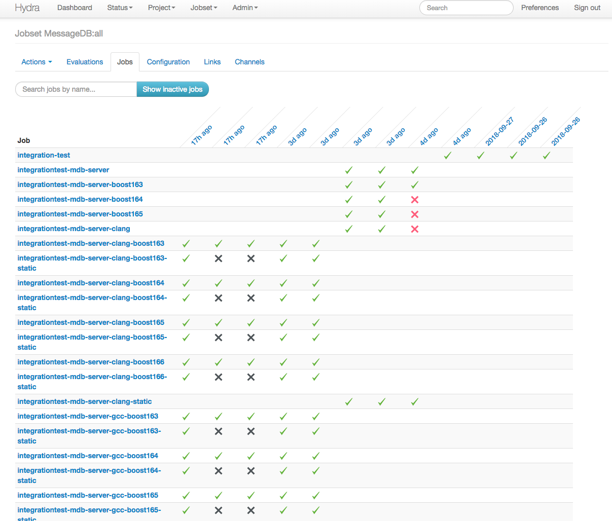

# An example nix project with C++ and Python

This project consists of 2 applications that model a writer and a reader to/from a postgres database:

The "server" application (C++) listens on TCP socket 1300 and writes into the database whatever it receives.
The "webserver" application (Python) is either a script that just prints the database content, or a webserver script (both included) that listens on port 8000 and lists the latest 10 database "messages".

Both applications are relatively simple and stupid as they are mere demonstration vehicles for showing:

- how to setup a reproducible working environment with toolchain and library dependencies etc. with a single command using `nix`
- how to build the application(s) with different compilers, different library versions, and select dynamic/static linking with a single parametrized command using `nix`
- how to make the build process reproducible so that it still works in a few years on completely different linux environments, by pinning all versions of the toolchain down using `nix`
- how to automatically create minimal [`docker`](https://www.docker.com/) images (so minimal that they contain no base distro image) using `nix`
- how to run completely automated integration test scnearios in VMs using `nix`


## Dependencies

At **compile time**, the applications need the following:

- server
  - C++ compiler toolchain ([GCC](https://gcc.gnu.org/) or [clang](https://clang.llvm.org/))
  - [`cmake`](https://cmake.org/) (meta) build system
  - [`boost`](https://www.boost.org/) library
  - [`libpqxx`](http://pqxx.org/development/libpqxx) library (C++ postgres interface)
  - [`gtest`](https://github.com/google/googletest)
- webserver
  - [`python`](https://www.python.org/) version 3
  - [`flask`](http://flask.pocoo.org/) library (webserver)
  - [`psycopg2`](http://initd.org/psycopg/) library (postgres interface)

The applications can be compiled (the C++ app) and both be run without nix at all.
But then, you have to install/configure all dependencies yourself - with `nix`, everything will be handled automagically.

## Build

In order to build the server app, do the following:

```bash
$ cd $project/server
$ nix-build
# You may now run ./result/bin/messagedb-server
```

In order to package the python app into a wrapper script that can be called like any binary, do the following:

```bash
$ cd $project/python_client
$ nix-build
# You may now run ./result/bin/mdb-webserver 
```

The python wrapper calls python with the dependencies in place, no way to call it with the wrong python interpreter. 
(This way of packaging a python app is completely optional, `nix` does not force you to do so)

`nix` can be obtained [here](https://nixos.org/nix/download.html).
There is always the quick and unsafe `curl | sh` way to install, but there are also instructions for binary verification.

## Build in different configurations

The server app can be compiled in different configurations:

- Compiler (can be easily extended/customized.)
   - GCC 7.3.0 (That is the default choice in the current package list. Can be easily parametrized, of course!)
   - GCC 8.2.0
   - clang 5.0.2
   - clang 6.0.1
   - clang 7.0.0
- `boost` versions 1.6.3, 1.6.4, 1.6.5, 1.6.6, 1.6.7, 1.6.8
- Binary linkage
   - static (single-file with no further runtime dependencies)
   - dynamic
   
To select one configuration, run:

```bash
$ cd $project
$ nix-build release.nix -A mdb-<tab key stroke>
mdb-server-clang-boost163         mdb-server-gcc-boost163-static
mdb-server-clang-boost163-static  mdb-server-gcc-boost164
mdb-server-clang-boost164         mdb-server-gcc-boost164-static
mdb-server-clang-boost164-static  mdb-server-gcc-boost165
mdb-server-clang-boost165         mdb-server-gcc-boost165-static
mdb-server-clang-boost165-static  mdb-server-gcc-boost166
mdb-server-clang-boost166         mdb-server-gcc-boost166-static
mdb-server-clang-boost166-static  mdb-webservice
mdb-server-gcc-boost163
$ nix-build release.nix -A mdb-server-gcc-boost166
# You may now run ./result/bin/messagedb-server
```

## Generate `docker` images for both apps

Compiling and installing the docker images is simple.
The step of the docker image creation does not even require you to have `docker` on your system.

server:

```bash
$ cd $project
$ nix-build release.nix -A mdb-server-docker
$ du -sh $(readlink -f result)
43M	/nix/store/r0094idq8gb3723xpgzs27p9amwym0cg-docker-image-mdb-server.tar.gz
```

The docker image with the static version of the library is a bit smaller:

```bash
$ nix-build release.nix -A  mdb-server-docker-static
$ du -sh $(readlink -f result)
21M	/nix/store/4dp967bs7hyca85gnp7nfnz788ssc29r-docker-image-mdb-server.tar.gz
```

Please note that this can of course be further reduced, but then the example would go out of scope and we have a nice starting point already.

The webserver docker image:

```bash
$ nix-build release.nix -A mdb-webservice-docker
$ du -sh $(readlink -f result)
60M	/nix/store/l4ipb3p325yaflsdna8h7nijla61vwrz-docker-image-mdb-webservice.tar.gz
```

What's particularly interesting about these docker images compared to conventionally created images is, that they only contain the run-time dependencies they need.
This means that for the statically linked binary, the corresponding docker image, in addition to bash and its run-time dependencies, only contains the binary itself. Likewise, for the dynamically linked binary, and the python webserver, the docker images contain exactly the needed dependencies, e.g. Python 3.xyz for the webserver.
In contrast, building a Docker image traditionally, e.g., with a Docker file built upon a Ubuntu/Debian/Fedora base image, would quickly result in an image size around hundreds or MB.

## Integration tests

There is only one integration test in this example.
It does the following

- Create a complete Linux VM that contains at least:
  - A preconfigured postgres DB (with role and DB for test user)
  - both applications
  
Running the test does the following:
  - Boot the VM
  - wait for postgres to start
  - then start the server app
  - then start the webservice app
  - feed some data into the VM via the server app
  - check if the DB is in the right state
  - check if the webserver's output is correct
  
This integration test scenario can easily be run with all different build configurations of the server app.
The NixOS distribution tests many of its packages with such integration tests.
These are however much more complex by running full herds of VMs in virtual networks, to some extent even with the X desktop activated and OCR etc. - out of scope for this example.

To run the integration tests, do:

```bash
$ nix-build release.nix -A integrationtest-mdb-server-<tab key stroke>
integrationtest-mdb-server-clang-boost163         integrationtest-mdb-server-gcc-boost163
integrationtest-mdb-server-clang-boost163-static  integrationtest-mdb-server-gcc-boost163-static
integrationtest-mdb-server-clang-boost164         integrationtest-mdb-server-gcc-boost164
integrationtest-mdb-server-clang-boost164-static  integrationtest-mdb-server-gcc-boost164-static
integrationtest-mdb-server-clang-boost165         integrationtest-mdb-server-gcc-boost165
integrationtest-mdb-server-clang-boost165-static  integrationtest-mdb-server-gcc-boost165-static
integrationtest-mdb-server-clang-boost166         integrationtest-mdb-server-gcc-boost166
integrationtest-mdb-server-clang-boost166-static  integrationtest-mdb-server-gcc-boost166-static
```

The result of such integration tests is a HTML/XML log document in the `result` folder.

## Nix CI

NixOS comes with a service for continuous integration, called [`hydra`](https://github.com/NixOS/hydra).
It does not look as polished as other CIs and its integration is very github centric (because `nix` and `NixOS` source code and package lists are hosted on github), but it is generally extensible with plugins.

A screenshot of a private hydra instance building this project:



